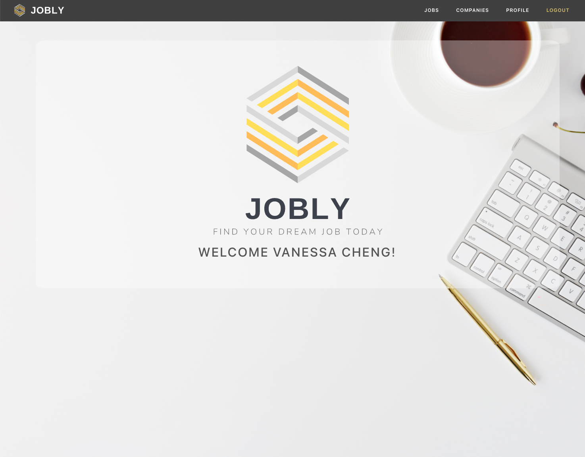
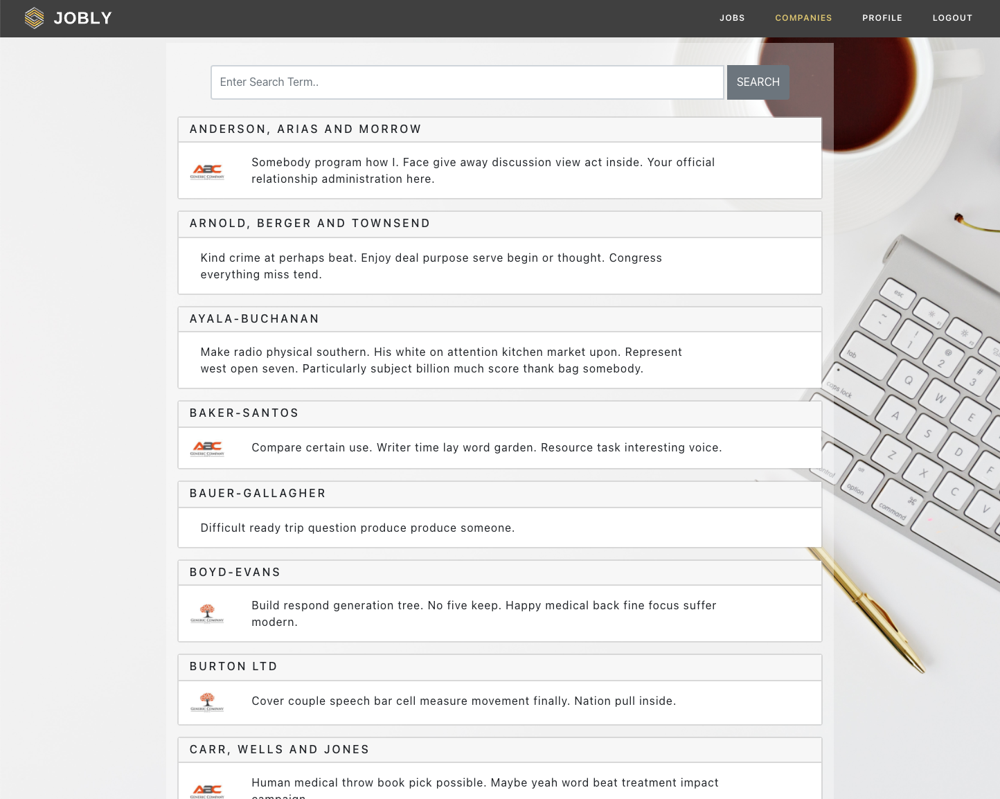
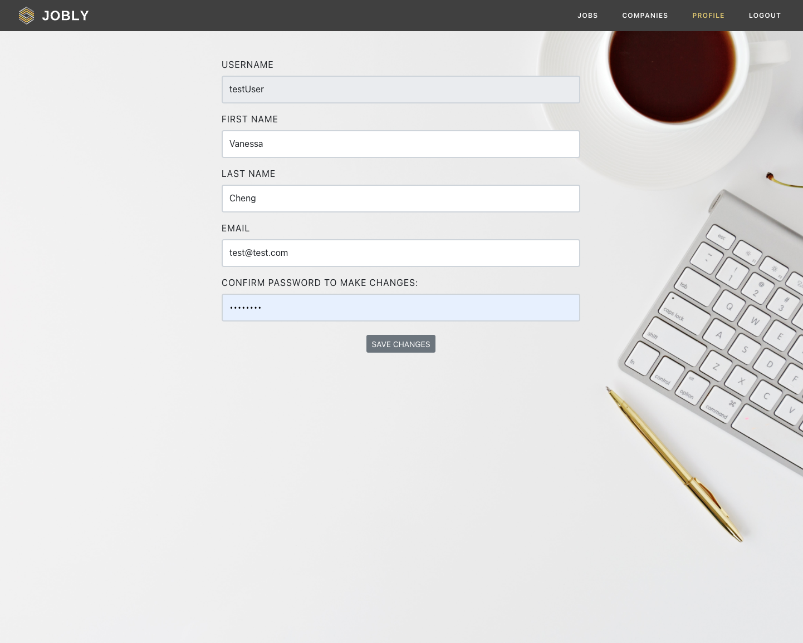

# Jobly
An application to help users find and apply to a job. This application uses:
- React
- Bootstrap
- Express
- PostgreSQL

# App Features
Account creation is required to explore features of the app. Valid email address is not required, but password is hashed and account is authenticated using bcrypt.

For demo purposes, please use username: "testuser", password: "secret"

Once logged in, user can explore randomly generated list of companies, tab through pages, and search for keywords in company names. Selecting a company will display all jobs available from that company.

Similar browsing experience exists for jobs. User can apply to jobs, but cannot un-apply (similar to live experience).

Users can update their profile, but cannot change their username. Their valid password is needed to update the profile.

# Project Screen Shots

# Installation Instructions

## To Install:
Use the command: `npm install`  

## To Create Postgres database jobly and seed data:
createdb jobly
psql jobly -f jobly.sql

## To Run Test Suite:
Launches the test runner in the interactive watch mode.
Use the command: `npm test`  

## To Start the Server:
Use the command: `npm start`  

## To Visit the App in Development Mode:
In the Browswer, open: `http://localhost:3000`  

The page will reload if you make edits.\
You will also see any lint errors in the console.

## To Build the App for Production:
Use the command: `npm run build`

Builds the app for production to the `build` folder.\
It correctly bundles React in production mode and optimizes the build for the best performance.

The build is minified and the filenames include the hashes.\
Your app is ready to be deployed!

# Future Features
Display company that specific job is available for
Allow users to un-apply to jobs within certain timeframe
Dynamic live searching
Track jobs user has applied to
Upload resume
Add new companies and corresponding jobs
Search by industry, position, size, etc.