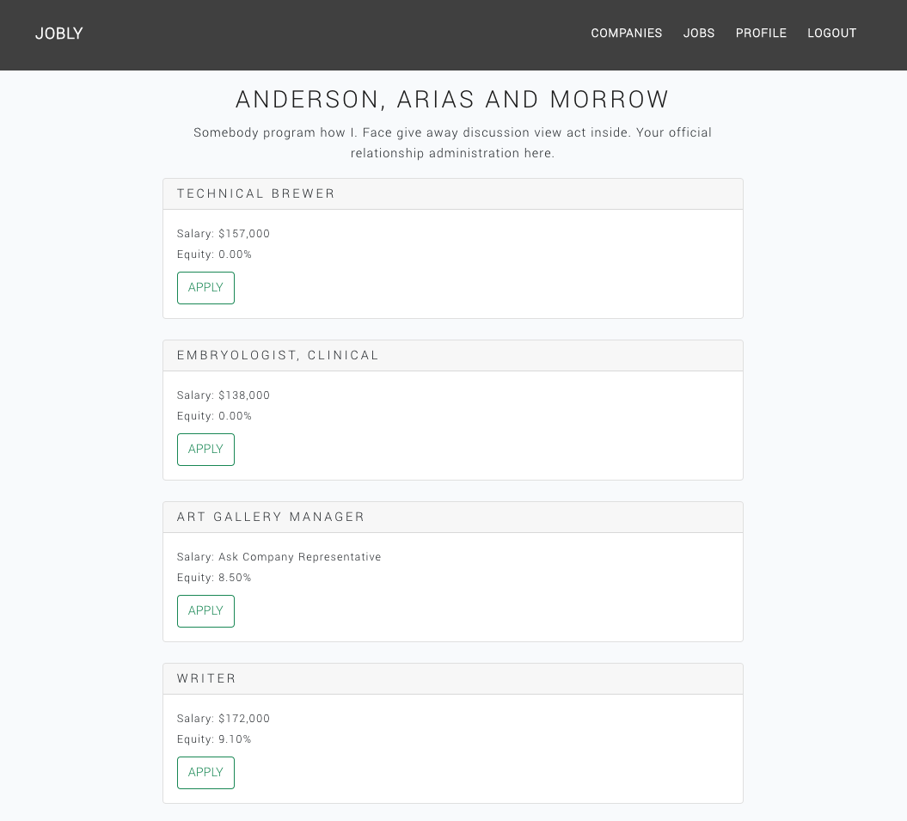

# Jobly
An application to help users find and apply to a job. This application uses:
- React
- Bootstrap
- Express

# Project Screen Shots

# Installation Instructions

## To Install:
Use the command: `npm install`  

## To Run Test Suite:
Launches the test runner in the interactive watch mode.
Use the command: `npm test`  

## To Start the Server:
Use the command: `npm start`  

## To Visit the App in Development Mode:
In the Browswer, open: `http://localhost:3000`  

The page will reload if you make edits.\
You will also see any lint errors in the console.

## To Build the App for Production:
Use the command: `npm run build`

Builds the app for production to the `build` folder.\
It correctly bundles React in production mode and optimizes the build for the best performance.

The build is minified and the filenames include the hashes.\
Your app is ready to be deployed!
